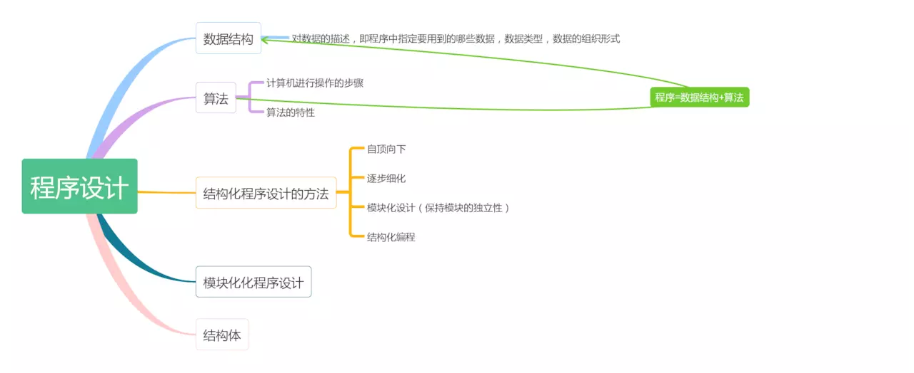

> 算法，数据结构，程序设计方法，语言工具4个方面是一个程序设计人员所应该拥有的，算法是灵魂，数据结构是加工，对象语言是工具。由此可见算法和数据结构的重要性，不管我们选择Java，c语言还是其他开发语言，它们都只是一种语言工具。核心和灵魂依旧在算法和数据结构。

## 算法是什么

算法是解决“做什么”和“怎么做”的问题；在我们日常的操作语句中体现的淋淋尽致，如果我们不了解算法也就谈不上程序设计；掌握了算法就是掌握了程序设计的灵魂

### 算法的特性

* 有穷性：算法应该包含有限的操作步骤
* 确定性：算法中的每一个步骤应该是确定的
* 有零或多个输入：执行算法的时候需要从外界取得必要的信息
* 有一个或多个输出：算法的目的是为了求解，“解”就是输出
* 有效性：每个步骤应该是有效的，并得到确定的结果

>好的算法应该是：速度快，存储空间少

## 数据结构

* 数据元素：是组成数据的有一定意义的基本单位；也被称为记录；（比如学生，老师
* 数据项：一个数据元素可以有若干个数据项组成；是数据项不可分割的最小单位；（比如学生的姓名，学号等）
* 数据对象：数据元素具有相同数量和类型的数据项；（比如学生有姓名，学号，性别等相同的数据项）
* 数据结构：相互之间存在一种或者多种特定关系的数据元素集合；数据结构按照视点不同可分为：逻辑结构和物理结构

### 逻辑结构：数据对象中数据元素之间的关系

* 集合结构：数据元素除了同属于一个集合之外，她们没有任何关系
* 线性结构：数据元素之间一对一关系
* 树形结构：数据元素之间存在一对一或一对多的层级关系
* 图形结构：数据元素是多对多的关系

### 物理结构
物理结构(存储结构)：数据的逻辑结构在计算机中的存储形式

* 集合结构：数据元素除了同属于一个集合之外，她们没有任何关系
* 顺序结构：把数据元素存放在地址连续的存储单元里；(数组)
* 链式结构：把数据元素存放在任意的存储单元里，这组存储单元可以是连续的，也可以是不连续的

>逻辑结构是面向问题的，物理结构是面向计算机的；
>我们应该注重的就是物理结构，将数据及其逻辑关系存储到计算机内存中去
>线性,树形,图形,链式是数据结构的重点和难点

